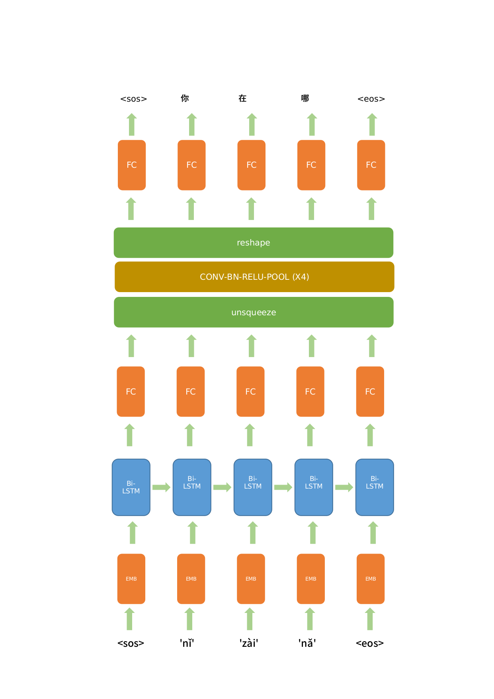

# pinyin2hanzi
拼音转汉字,  convert pinyin to 汉字 using deep networks

### TRAINING DATA
As a light weight example, trainin data are downloaded from the AI shell speech recognition corpus, 
found in http://openslr.org/33/. The transcripts rather than the audio data are used. A copy of the transcript file is found in the ./data folder

### MODEL ARCHITECTURE

## TO DO
1. Use process_ai_shell_transcript_sd.py to convert ai-shell transcripts from 汉字 to 带声调的拼音(pinyin with tones)

2. run trian.py to train the model

3. run inference_sd.py to do inference

### 一些带声调拼音的测试结果如下, results obtained by running inference_sd.py

néng gòu yíng de bǐ sài zhēn de hěn kāi xīn

能够赢得比赛真的很开心

yě qǔ de le sān xiàn piāo hóng de chéng jī

也取得了三线飘红的成绩

guó yǒu qǐ yè bù bì yě wú xū jiè rù yíng lì xìng qiáng de shāng pǐn fáng kāi fā

国有企业不必也无需介入盈利性强的商品房开发

sī fǎ jiàn dìng jī gòu shì dú lì fǎ rén

司法鉴定机构是独立法人

bǎo bǎo zhòng wǔ diǎn èr jīn

宝宝重五点二斤

### Reference

Some of the code borrowed from https://github.com/bentrevett/pytorch-seq2seq

Model architecture was designed by myself. It is very likely that the model looks partly the same as some existing works, I apologized for not citing them. Please let me know if you think I should cite some papers.

